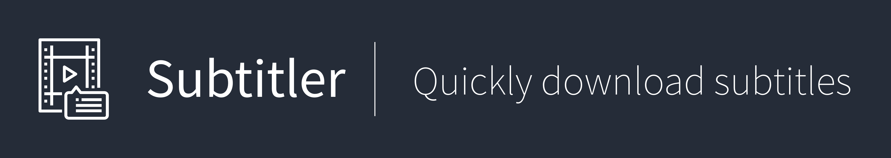
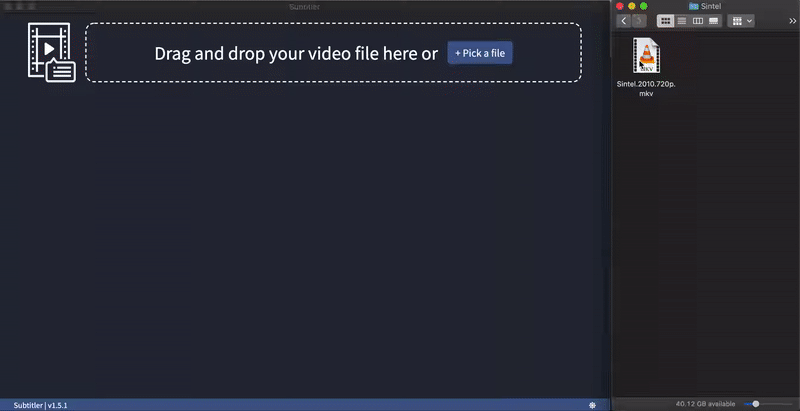

<br>

<p>
  Subtitler is built using <a href="https://electron-react-boilerplate.js.org/">Electron React Boilerplate</a>. That includes <a href="https://electron.atom.io/">Electron</a>, <a href="https://facebook.github.io/react/">React</a>, <a href="https://github.com/reactjs/redux">Redux</a>, <a href="https://github.com/reactjs/react-router">React Router</a>, <a href="https://webpack.github.io/docs/">Webpack</a> and <a href="https://github.com/gaearon/react-hot-loader">React Hot Loader</a> .
</p>

<br>
<hr />

<p align="center">
  <a href="https://youtu.be/3-ikI6ZxBZA" target="_blank"></a>
</p>

<hr />
<br />

## Install

First, clone the repo via git and install dependencies:

```bash
yarn
```

## Run Development

Start the app in the `dev` environment. This starts the renderer process in [**hot-module-replacement**](https://webpack.js.org/guides/hmr-react/) mode and starts a webpack dev server that sends hot updates to the renderer process:

```bash
yarn dev
```

## Packaging for Production

To package apps for the local platform:

```bash
yarn package
```

## Debugging on Production

To package apps for the local platform:

```bash
yarn cross-env DEBUG_PROD=true yarn build yarn cross-env DEBUG_PROD=true yarn start
```

<!-- ## Donations

**Donations will ensure the following:**

- 🔨 Long term maintenance of the project
- 🛣 Progress on the [roadmap](https://electron-react-boilerplate.js.org/docs/roadmap)
- 🐛 Quick responses to bug reports and help requests -->

## Maintainers

- [Sachin Srinivasan](https://github.com/s8sachin)

## License

MIT © [Sachin Srinivasan](https://github.com/s8sachin)

## Thanks to

- [Open subtitles](https://www.opensubtitles.org/)
- [opensubtitles-api](https://www.npmjs.com/package/opensubtitles-api)
- [Electron React Boilerplate](https://electron-react-boilerplate.js.org/)

## Disclaimer

📢📢

1. The app doesn't track you down in ANY way. Not Google Analytics, or any other service. [Open a bug](https://github.com/s8sachin/subtitler/issues/new?assignees=s8sachin&labels=bug) and let me know what do you think.
2. The app doesn't store ANY media files ANYWHERE except on the device who use this app.
3. This app downloads only public data available from [Open Subtitles](https://www.opensubtitles.org).

⚖ 🕵

## Download

- Free 💰
- No ads 📣

Find your download: [https://github.com/s8sachin/subtitler/releases/latest](https://github.com/s8sachin/subtitler/releases/latest)
